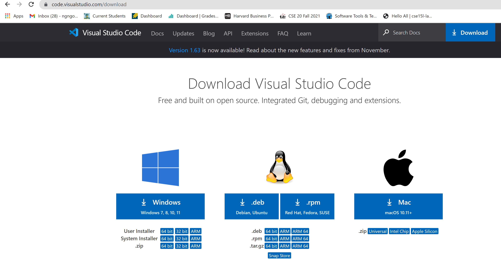
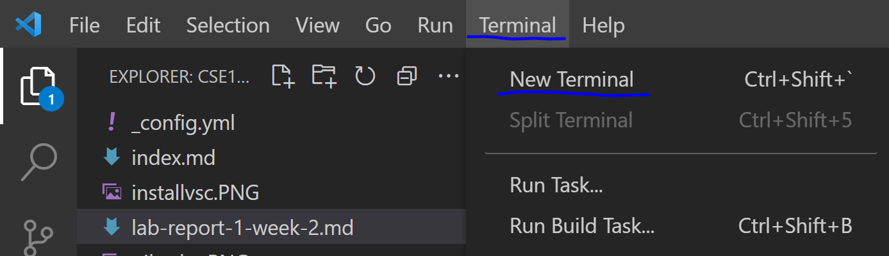
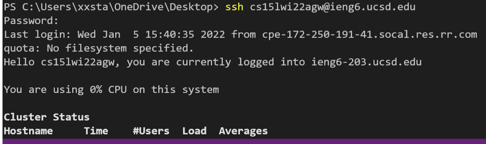
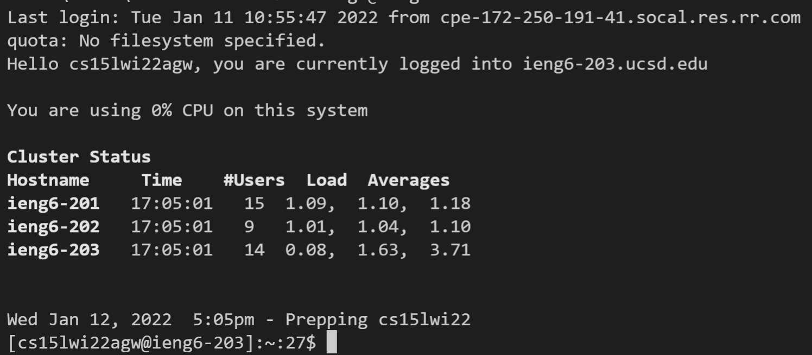
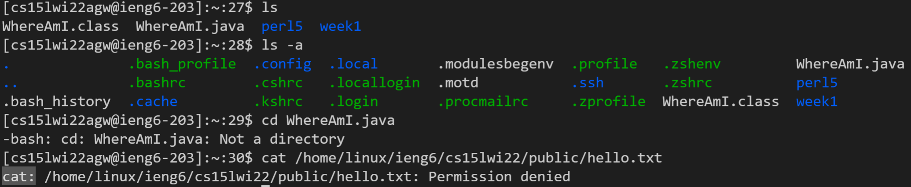
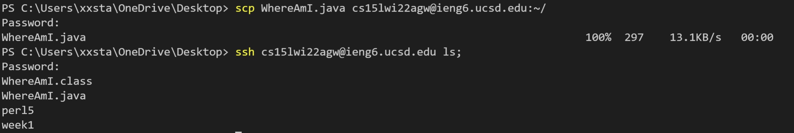
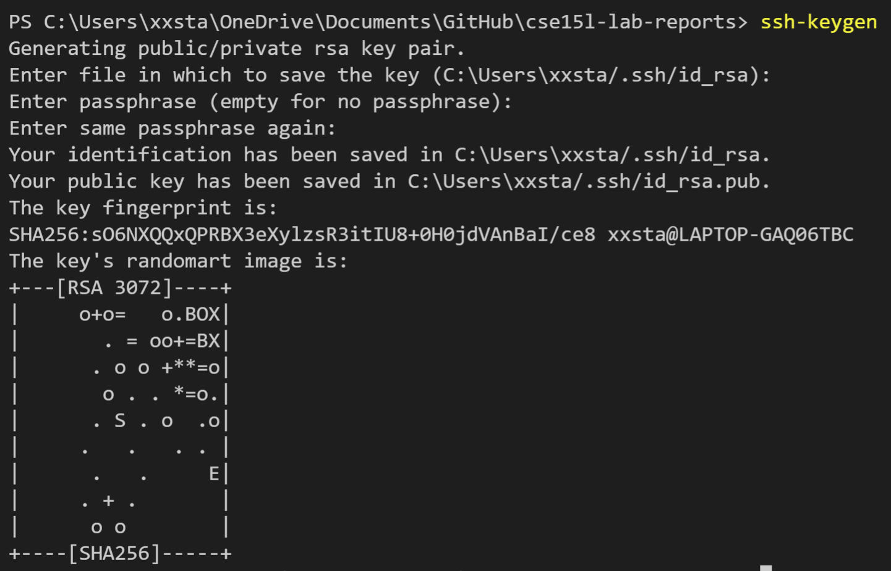
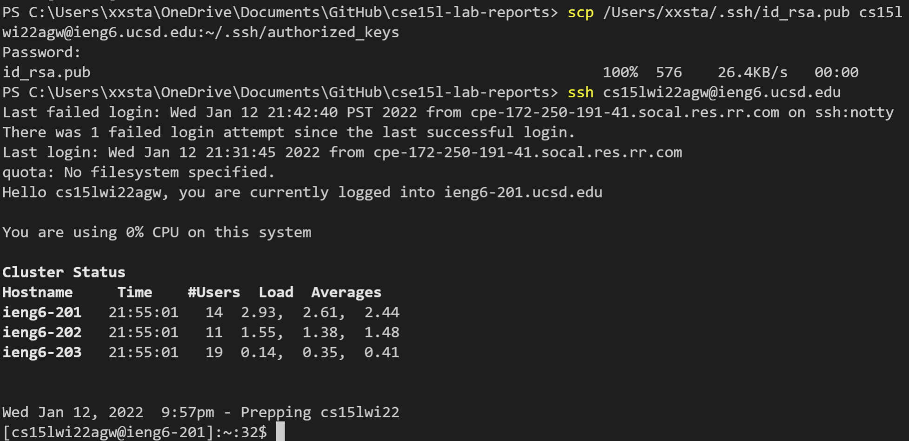
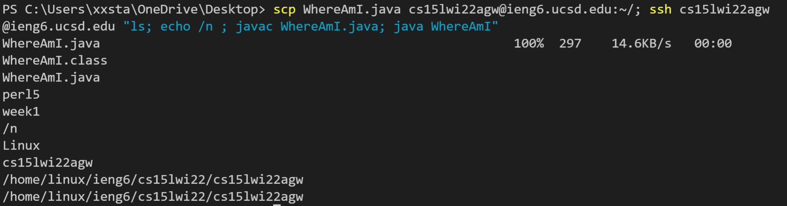

# **How to log into ieng6(Windows)**
## **1)Installing Visual Studio Code**
---
In order to install this, first go to the page [download link for vsc](https://code.visualstudio.com/download).
This is what the page should look like:   
Next, click the download button for your OS, i clicked windows.  
## **2) Remotely Connecting**
---
Try to find your username on [link](https://sdacs.ucsd.edu/~icc/index.php). Mine happens to be cs15lwi22agw. Then open vsc, and click terminal>new terminal.

* If you are on windows, download [OpenSSh](https://docs.microsoft.com/en-us/windows-server/administration/openssh/openssh_install_firstuse).  
* If it asks if you want to continue connecting, then type yes.  
* To ssh use this command: 
> `ssh <your username>@ieng6.ucsd.edu`
* For example: I would type 
> `ssh cs15lwi22agw@ieng6.ucsd.edu`
* Click enter. It will prompt you for your password, which you should type in, and click enter when you are done.  
  
This is what it should look like:
  
  
  If you did it correctly, it should change the information before your cursor and display: 
  

## **3)Trying Some Commands**
---

* Here I tried the commands ls, ls -a, cd WhereAmI.java, and cat.
* I tried to change directories to a file(you can only change directories to a folder), which didn't work. 
## **4)Moving Files with scp**
---
To move files, use the command 
>`scp <filename> <destination>`  

For example: 
>`scp WhereAmI.java cs15lwi22agw@ieng6.ucsd.edu:~/`  
* This will move a file called WhereAmI.java from the client computer to the home directory of the server computer.  

It should look like this ( if ls in the server, then you can see the file): 

## **5)Setting an SSH Key**
---
First, create the .ssh folder on the server computer: 
1. login to ieng6
    >`ssh cs15lwi22agw@ieng6.ucsd.edu`

2. Create a directory/folder named .ssh
    >`mkdir .ssh`

Then make a SSH key using this command:
> `ssh-keygen`

  
  Next, move the public key that was just generated by the command `ssh-keygen` on the client computer into the authorized_keys folder on the server computer.
  >`scp /Users/xxsta/.ssh/id_rsa.pub cs15lwi22agw@ieng6.ucsd.edu:~/.ssh/authorized_keys`

It is now possible to ssh without a password

## **6)Optimizing Remote Running**
---
You can run multiple commands in the server computer by doing:
>ssh cs15lwi22agw@ieng6.ucsd.edu "javac WhereAmI.java; java WhereAmI"
* Note: " " allow us to specify for these commands to be run on the server
* Note: ; allows us to seperate commands.  
* Note: no password prompt because of the ssh key

An example of this:

> `scp WhereAmI.java cs15lwi22agw@ieng6.ucsd.edu:~/; ssh cs15lwi22agw@ieng6.ucsd.edu "javac WhereAmI.java; java WhereAmI"`
* Translation: run scp of WhereAmI.java to home directory in server. Then ssh into ieng6 and thne compile and run WhereAmI.java.

The combination of SSH keys and being able to run multiple commands in one line allows us to quickly update changes in files from the client computer to the server computer. 
