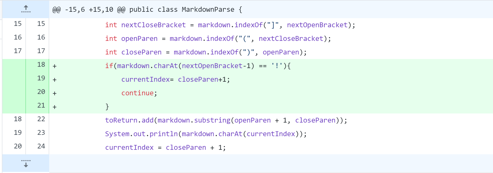
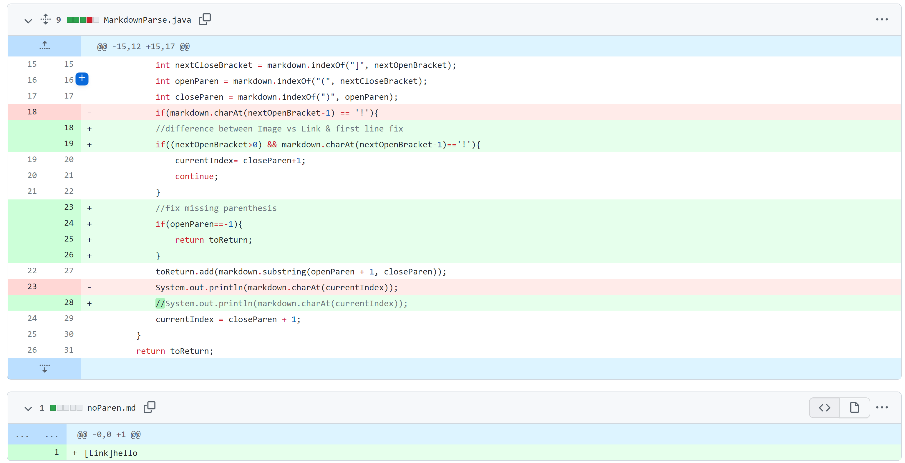

# **Lab Report 2 - Week 4**
## **1) Differentiate between Image and Link**

Test file that produced failure: [new-file.md](https://github.com/ngngo0/markdown-parse/blob/b73b94f14c0c8a5054b977a2519f121850200718/new-file.md)

Command: ```java MarkdownParse new-file.md```

Output: ```[pic, https://help.com]```

**Explanation:**

The bug is that the code can't differentiate between Images and links. As a result, the failure-inducing input text file contains both Images and Links(symptom). The syntax for both is very similar but Images require a ```!``` in front of their ```[]```. To fix this, we check to find the exclamation in front of th;

Note: This creates another bug #2.

## **2) First Line Error**

Test file that produced failure: [firstline.md](https://github.com/ngngo0/markdown-parse/blob/28f3d24f1c8b98f11927d200516e30f99949a7d4/firstline.md)

Command: ```java MarkdownParse firstline.md```

Output: ```Exception in thread "main" java.lang.StringIndexOutOfBoundsException: String index out of range: -1```

**Explanation:**

The bug is that whenever the link is on the first line, and we check for the ```!```, we end up giving ```.charAt``` an invalid input. The failure-inducing input text file has a link in the first line and produces an ```StringIndexOutOfBoundsException```.

## **3) No Parenthesis**

Test file that produced failure: [noParen.md](https://github.com/ngngo0/markdown-parse/blob/b73b94f14c0c8a5054b977a2519f121850200718/noParen.md)

Command: ```java MarkdownParse noParen.md```

Output: ```Exception in thread "main" java.lang.StringIndexOutOfBoundsException: String index out of range: -1```

**Explanation:**

The bug here is that the code will try to create a substring from index openParen+1 to closeParen but if ```"("``` or  ```")"``` are not found then closeParen and/or openParen will equal -1(beacuase of ```.indexOf```). As a result, the failure-inducing input text file that does not contain parenthesis produces the symptom: a ```StringIndexOutOfBoundsException``` error message. This is thrown since -1 is not a valid parameter for the substring method.


