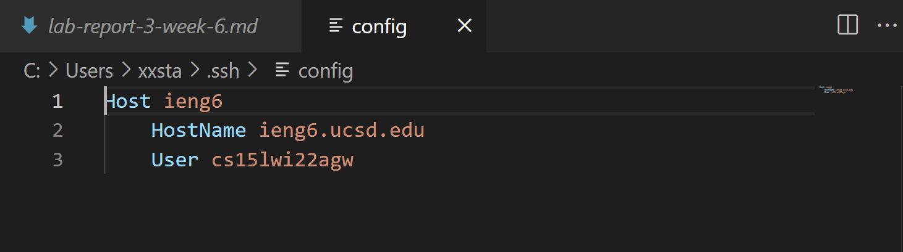
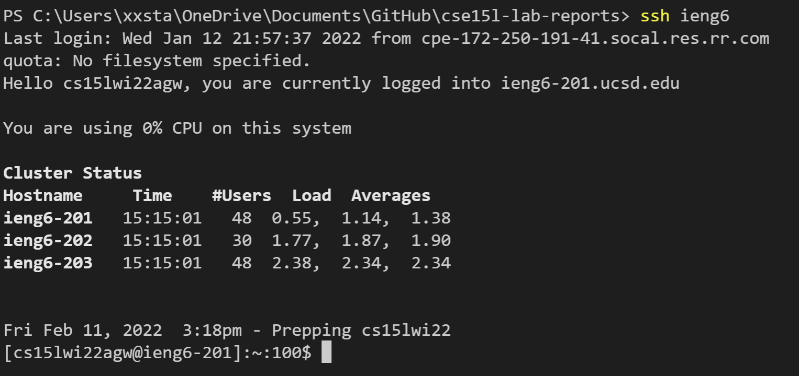
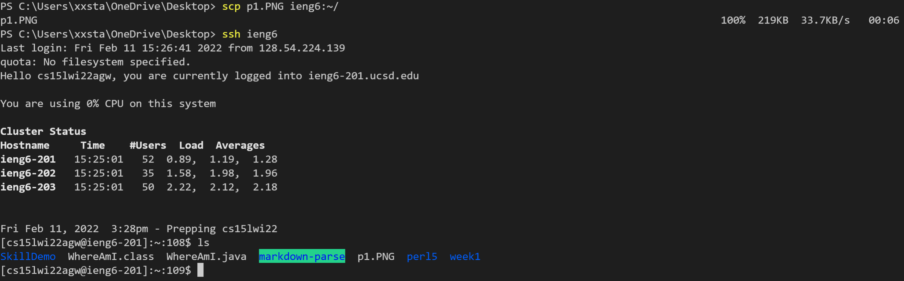

# **Lab Report 3 - Week 6**
## **Streamlining ssh Configuration**

## **Part 1**

* This config file is in my .ssh file. Which can be seen in the file path just above the first line of code. I edited it in vsc, where this pic was taken. My alias is ieng6.

## **Part 2**

* This is a picture of me running the command ```ssh ieng6``` and being successfully logged into ieng6. 

## **Part 3**

* This is a picture of me using the command ```scp p1.PNG ieng6:~/``` to move the file p1.PNG in my current directory to the home directory of my ieng6 account. I used ```ls``` to confirm that the file successfully copied over.