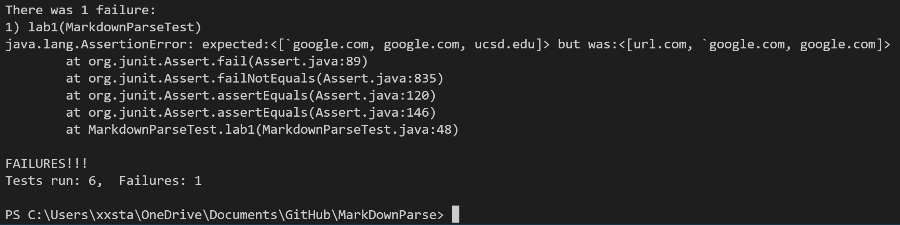
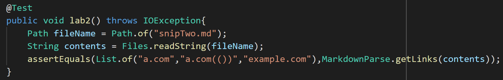
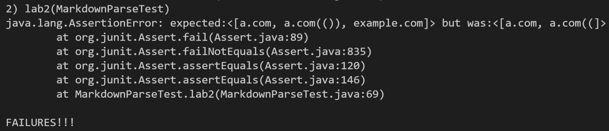
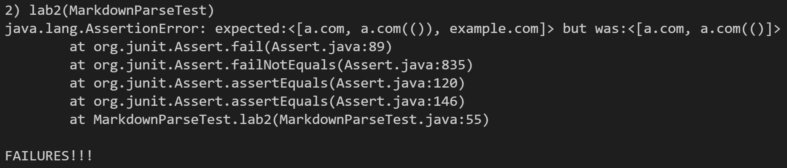
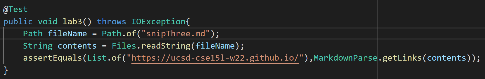
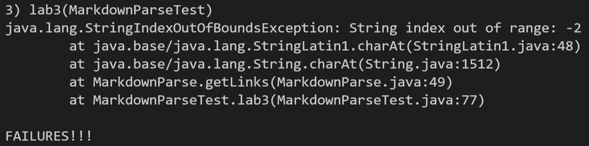
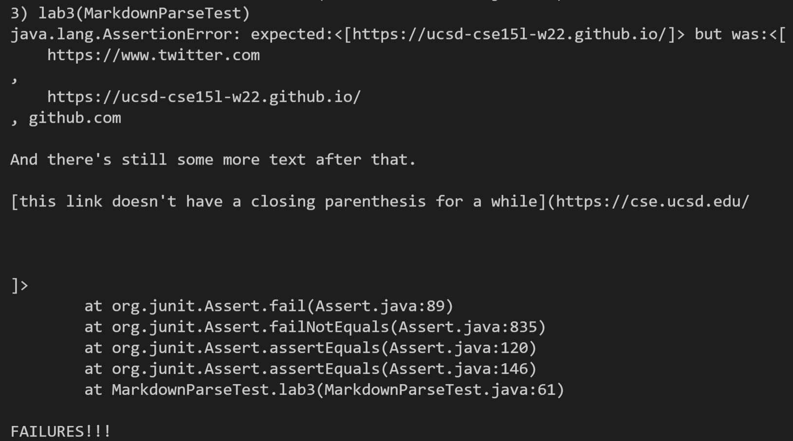

# **Lab Report 4 - Week 8**
## **Markdown Snippets**
Links:

Mine: [my markdown file](https://github.com/ngngo0/markdown-parse)

Theirs: [the clone that  i edited](https://github.com/ngngo0/MarkDownParse/tree/b02f4e42520d09bf96756d7640ee144affbd6b76)

[the original one i forked from](https://github.com/ExtraExaByte/MarkDownParse)
## **Snippet 1**
----
Test: (snipOne.md is just a copy of Snippet 1) 

**My implementation(failed):**

**Their implementation(failed):**

## **Snippet 2**
---
Test: (snipTwo.md is just a copy of Snippet 2) 

**My implementation(failed):**

**Their implementation(failed):**

## **Snippet 3**
---
Test: (snipThree.md is just a copy of Snippet 3) 

**My implementation(failed):**

**Their implementation(failed):**

## **Questions**
---
**Snippet 1**: 

I think for my program, it is possible to make a small change that can fix inline code with backticks. It could be solved if we just check for a backtick before we search for the first open bracket. That way we know what to *not* consider as valid brackets. 

**Snippet 2**: 

I think for my program a small fix would be possible. It might look something like checking for open parenthesis in between the open parenthesis and the first closed parenthesis after that. If there is a parenthesis in between, then search for (however many other open parenthesis that were found) their corresponding closed paranthesis.

**Snippet 3**:

 I don't think a small fix would fix Snippet 3. This is because my code doesn't yet have a solution for when the program goes into an infinite loop when there are characters after the last parenthenthesis. So we would have to fix that first, and then use more lines to fix cases that have newlines in brackets and parentheses.