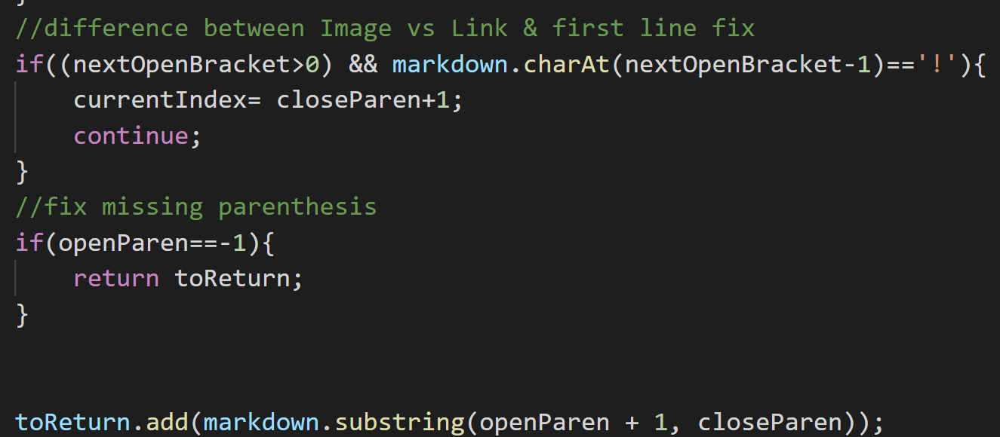
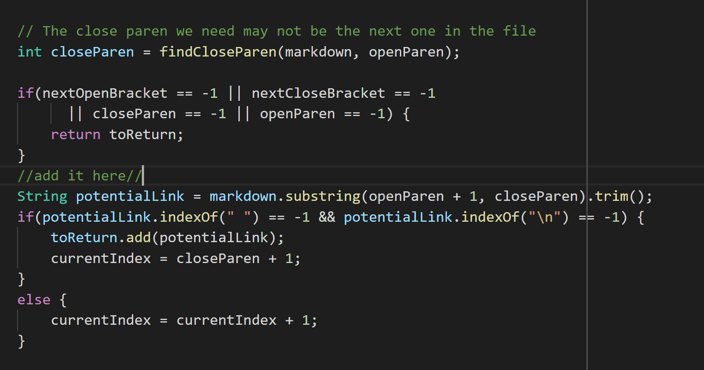

# **Lab Report 5 - Week 10**

## Setup
---
In order to find these changes, I ran 
>`bash script.sh` 

which is a for loop that prints all the files and runs MarkdownParse on each file.

```
for file in test-files/*.md;
do
  echo $file
  java MarkdownParse $file
done
```
I did this for both my version of Mardown Parse and the other version of Mardown Parse(lab 9 one). Then I changed directories to the 2 different implementations and wrote sent the output of the script.sh to a txt file. 
>`bash script.sh > results.txt`

>`bash script.sh > Results.txt`

After that, i used diff in order to find the differences and sent the output to another file named diffs.txt.
>`diff myResults.txt ~/mark/results.txt > diffs.txt`

To find the differences, i'm looking through diffs.txt, and finding the line number each number corresponds to by having myResults open.

## **First bug**
---
This is for test 22.md

```[foo](/bar\* "ti\*tle")```

My output:
> [/bar\* "ti\*tle"]

Other output:
> []

I think that neither are correct, because the expected output according to [this](https://spec.commonmark.org/dingus/) would be:
> bar*

**Problem:**
---
The problem is that my implementation will add everything between the parenthesis to toReturn. However, this is not the case in the expected output. 

So what we should do is filter the substring that we adding to toReturn. So in my case, instead of immediately adding this substring, make it into a variables and check if there are certain characters in it like quotations. also let it check for any \\ characters and make sure not to add them unless there's 2. And more rules like that.



## **Second bug**
---
This is for test 577.md

``````

My output:
> []

Other output:
> [train.jpg]

Expected output according to [this](https://spec.commonmark.org/dingus/):
> []

I think that mine is correct, because this test contains an image, and not a link. Therefore it shouldn't be put inside our output for a getLinks() method.

**Problem:**
---
The problem here is that the other output counts any pair of []() as links, and doesn't check for an exclamation before its [. 



I think as a fix, at the place where it says "add it here", we should add something where we check if the character before the first open bracket is an ! or not. On top of that, we should also check if the [ is the first character in the page, because then we can safely check the character before the [ without an indexOutOfBounds exception.